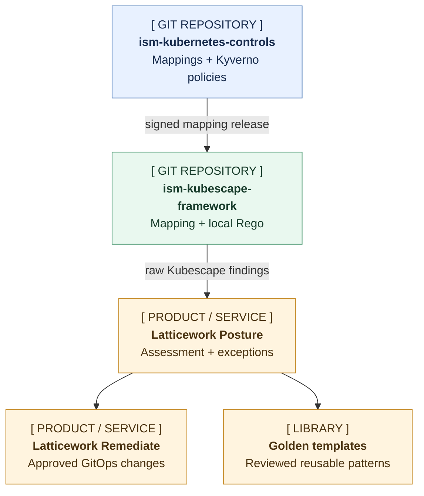

# Kubescape ISM framework for Kubernetes

Use this repository to scan Kubernetes manifests or a live cluster against 13 controls mapped to the Australian Signals Directorate's [Information Security Manual](https://www.cyber.gov.au/ism) (ISM). The repository combines a reviewed mapping snapshot with local Rego rules, builds a versioned Kubescape framework, and writes raw JSON findings.

Admission policies check resources as they enter a cluster. This framework lets you check existing cluster state and manifests in CI with the same reviewed ISM-to-Kubernetes mappings. The guided cluster scan uses a short-lived identity that cannot read Secrets.

The JSON records scanner observations. Assessment reports, certification, full-ISM coverage, and controls outside Kubernetes sit outside this repository. ASD publishes the ISM and Essential Eight as separate documents; this repository implements ISM controls.

## Use it

### Scan a live cluster

```bash
make latticework-ism-scan
```

Start with this command. It asks for the cluster context, creates temporary read-only RBAC with a unique name, builds the scanner artifacts, and writes JSON under `evidence/`. Before it exits, it removes the RBAC, kubeconfig, and build artifacts. You do not need to run `make build` first.

The scan uses `kyverno/ism-approved-registries:registries` when that ConfigMap exists. If the default ConfigMap does not exist, it uses `docker.io/`, `ghcr.io/`, `quay.io/`, and `registry.k8s.io/`. To use your own cluster-managed ConfigMap, pass `NAMESPACE/NAME[:KEY]`:

```bash
TARGET_CONTEXT="$(kubectl config current-context)" \
REGISTRY_CONFIGMAP='policy/approved-images:registries' \
EVIDENCE_DIR=/tmp/ism-kubescape-evidence \
make latticework-ism-scan
```

The selected key must contain newline-separated registry or repository patterns. The scan creates temporary `get` access to that one ConfigMap; it does not create or approve the allow list. The scan fails if it cannot read a ConfigMap set through `REGISTRY_CONFIGMAP`. Set `AUTO_YES=true` for a non-interactive run.

See [docs/live-cluster-scan.md](docs/live-cluster-scan.md) for registry options, non-interactive use, failure cleanup, and the lower-level existing-context workflow.

### Scan manifests

```bash
make build
kubescape scan framework ism-kubernetes ./path/to/manifests \
  --use-artifacts-from ./dist \
  --format json \
  --output ism-kubernetes-scan.json
```

Kubescape loads this repository's bundled framework, control metadata, Rego rules, controls inputs, and exceptions from `./dist` when you pass `--use-artifacts-from ./dist`. `make build` creates those files for direct Kubescape commands. The guided live scan creates them in a temporary directory.

## Where it fits



- [`ism-kubernetes-controls`](https://github.com/Latticework-Systems/ism-kubernetes-controls) owns the canonical ISM relationships and Kyverno admission policies.
- This repository consumes a reviewed `mapping/kubescape.json` snapshot and emits Kubescape findings. Update the snapshot with `make update-mapping CONTROLS_VERSION=<immutable-release-tag>`, which downloads and verifies the signed `kubescape.json` release asset from the controls repository. Review and commit the snapshot.
- Latticework Posture owns assessment and exceptions; Latticework Remediate and the golden-template library apply reviewed outcomes downstream.

The [`Update ISM mapping`](.github/workflows/update-mapping.yaml) workflow checks the controls repository each week. Maintainers can also start it on demand. For each new signed release that changes `kubescape.json`, the workflow verifies the release and asset, regenerates the framework, runs the build and rule tests, and opens a pull request for review. It leaves `main` unchanged.

Kubescape, NSA, CIS, and MITRE rules serve as provenance exemplars. The framework bundles local Rego, so upstream framework releases cannot change scan behaviour. Maintainers review upstream changes when they update a mapping or detector.

## Included controls

The generated `ism-kubernetes` framework contains:

- approved image registries;
- dedicated service accounts with default token automount disabled;
- dropped Linux capabilities;
- ingress and egress NetworkPolicy coverage;
- protected `cluster-admin` bindings;
- blocked host namespaces, `hostPath`, and `hostPort`;
- disabled privilege escalation;
- blocked privileged containers and `SYS_ADMIN`;
- blocked wildcard RBAC permissions;
- non-root containers;
- restricted Pod Security namespace coverage;
- read-only container root filesystems; and
- approved seccomp profiles.

These checks provide partial evidence for ISM-1182, ISM-1246, ISM-1416, ISM-1490, ISM-1604, ISM-1657, ISM-1871, ISM-1883, ISM-2128, and ISM-2143 in the September 2026 ISM. Organisational, identity-provider, endpoint, vulnerability-management, backup, control-plane, and assessor evidence require other sources.

## Repository contents

- `mapping/kubescape.json`: reviewed release snapshot from [`ism-kubernetes-controls`](https://github.com/Latticework-Systems/ism-kubernetes-controls)
- `rules/`: Rego rules with pass and fail fixtures
- `controls/`: generated Kubescape control metadata
- `frameworks/`: generated Kubescape framework definitions
- `scripts/`: build, test, integration, and live-scan helpers; each script documents its purpose at the top of the file
- `examples/scan-reader-rbac.yaml`: scan identity without Secret read access
- `tests/`: guided-workflow smoke test and manifest integration fixtures

## Develop

Install Python 3 and [OPA](https://www.openpolicyagent.org/docs/latest), then run:

```bash
make build
make test
make smoke
```

Install [Kubescape](https://kubescape.io/docs/install-cli/) to run:

```bash
make integration
```

`make test` checks each Rego rule against its JSON fixtures. `make integration` assembles the framework, scans both manifest fixture sets with Kubescape, and requires every compliant control to pass and every noncompliant control to fail.

`make build` creates:

- `dist/ism-kubernetes.json`
- `dist/controls-inputs.json`
- `dist/exceptions.json`: empty compatibility input that prevents Kubescape's missing-file warning

Kubescape looks for `exceptions.json` beside local artifacts. The build writes `[]`, which avoids the remote exception lookup and suppresses no findings. Latticework Posture owns exception justification, expiry, and review. The scanner can consume an approved scan-time exception artifact from Posture, but it does not create or approve exceptions.

To update from a reviewed, immutable [`ism-kubernetes-controls` release](https://github.com/Latticework-Systems/ism-kubernetes-controls#publishing-the-kubescape-mapping), run:

```bash
make update-mapping CONTROLS_VERSION=<immutable-release-tag>
```

The current controls repository release is `v0.2.0`. The target downloads the release asset and its published SHA-256 file with `curl`, verifies the checksum, replaces `mapping/kubescape.json`, and runs `make build test`. Review and commit the changes under `mapping/`, `controls/`, `frameworks/`, and `rules/*/rule.metadata.json`. The [mapping-update workflow](.github/workflows/update-mapping.yaml) runs this check on a schedule and opens a pull request when a newer release changes the mapping.

Set `imageRepositoryAllowList` in `dist/controls-inputs.json` before you rely on the approved-registry finding.

## Live-scan security

The guided scan requires `bash`, `kubectl`, `kubescape`, and `python3`. It:

1. creates read-only RBAC with a unique name after you confirm the target context;
2. mints a short-lived `ism-scan-reader` token;
3. creates a mode-`0600` kubeconfig containing one cluster, user, and context;
4. builds temporary scanner artifacts;
5. writes raw JSON under `evidence/`; and
6. removes the RBAC and local temporary files on success or failure.

The temporary kubeconfig contains the scan token and selected cluster connection details. The script does not copy credentials from your kubeconfig. The scan RBAC grants read access to the Kubernetes objects used by the 13 controls and excludes Secrets.

Treat the raw JSON as sensitive operational evidence. It can contain cluster resource names, image references, RBAC subjects, and ConfigMap data even though the scan identity cannot read Secrets. Review and sanitise evidence before sharing it outside the assessed environment.

See [docs/live-cluster-scan.md](docs/live-cluster-scan.md) for options and the lower-level existing-context workflow.

## Security and release integrity

GitHub Actions use full commit SHAs. CI downloads fixed OPA and Kubescape releases and verifies their SHA-256 checksums.

GitHub Actions reruns the build, fixture, smoke, and integration gates after a maintainer pushes a `v*` tag from `main`. It then publishes a GitHub Release containing the framework bundle, `SHA256SUMS`, and GitHub build-provenance attestation. Verify a downloaded release with:

```bash
TAG=<release-tag>
BASE="https://github.com/Latticework-Systems/ism-kubescape-framework/releases/download/${TAG}"
curl --fail --location --remote-name "$BASE/ism-kubernetes-bundle-${TAG}.tar.gz"
curl --fail --location --remote-name "$BASE/SHA256SUMS"
shasum -a 256 --check SHA256SUMS
```

The checksum command verifies the downloaded files' integrity. Use a Sigstore-compatible verifier to check the build-provenance attestation.

Report vulnerabilities through [SECURITY.md](SECURITY.md).

## Evidence boundary

A passing result means the included rules found no violation in the resources visible to the scan identity. It does not prove resource completeness, runtime behaviour, non-Kubernetes controls, or organisational compliance with the ISM.

## References

- [ASD ISM OSCAL artifacts](https://www.cyber.gov.au/ism/oscal)
- [Kubescape](https://github.com/kubescape/kubescape)
- [Kubescape regolibrary](https://github.com/kubescape/regolibrary)

## Licence

Apache-2.0.
